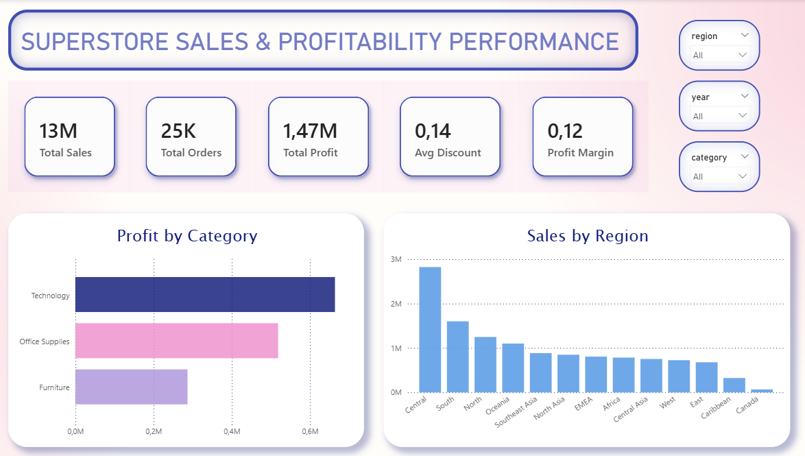
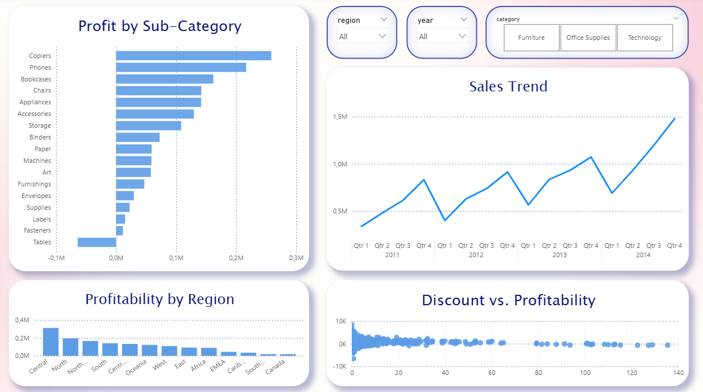

# Superstore Sales & Profitability Analysis

An end-to-end data analysis project focused on identifying loss-making factors and optimizing profitability using **Python** and **Power BI**.

## Project Objective
The goal of this project is to analyze the Global Superstore dataset to understand the drivers of sales and, more importantly, the factors leading to negative profit margins. We aim to provide actionable insights for business optimization. 

## 🛠️ Tech Stack
- **Data Cleaning & Analysis:** Python (Pandas, NumPy)
- **Visualization:** Power BI (DAX, Interactive Visuals)
- **Environment:** Jupyter Notebook

## 📂 Project Structure
- `SuperStoreOrders.csv`: The cleaned dataset used for analysis.
- `analysis_cleaning.html`: Detailed data cleaning and exploratory analysis (HTML report).
- `salesstore2.pbix`: The interactive Power BI dashboard file.
- `dashboard1.png` & `dashboard2.png`: Screenshots of the final dashboard.

## 📈 Key Insights & Findings
- Approximately **24% of all orders are loss-making**, indicating that 1 in 4 transactions is unprofitable.
- There is a strong negative correlation (-0.85) between **discount levels and profit margin**.
- Profit margins remain positive up to approximately **20-25% discount**, beyond which they turn negative.
- Orders with 30%+ discounts represent only 14% of sales volume but generate the vast majority of total losses.
- The **"Tables"** sub-category is the primary driver of loss, proving to be highly sensitive to aggressive discounting (turning unprofitable only above 30% discount).
- Shipping modes and customer segments show consistent margins, confirming that profitability issues are driven by pricing strategy, not operational costs.

- ## Business Recommendations
1. Implement a **global discount cap around 20-25%** to prevent unprofitable sales.
2. Require **approval for discounts exceeding 30%**, limiting them to strategic campaigns.
3. Review and monitor **high-discount product categories** for targeted pricing strategies.
4. Track **profit margin alongside sales volume** to ensure promotions remain profitable.

## 🖥️ Dashboard Preview

🔗 **[Click here to view the detailed Python Analysis & Data Cleaning Report (HTML)](analysis_cleaning.html)**

---
Developed by [Ceren Alagoz] - [(https://www.linkedin.com/in/ceren-alagoz-157a4b256/)]
